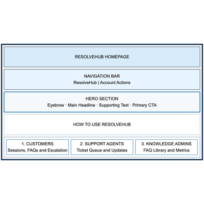
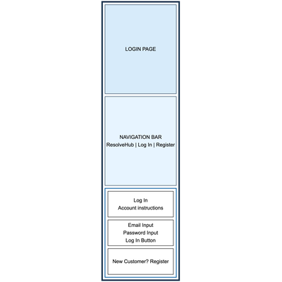
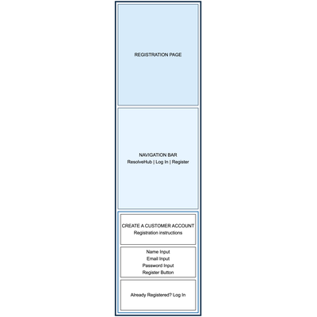
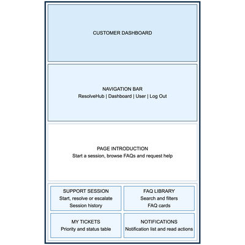
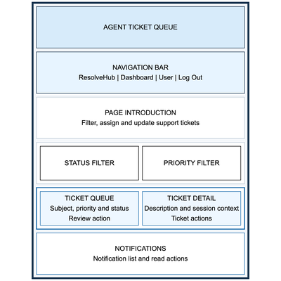
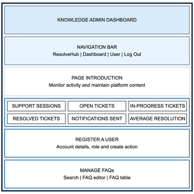

# ResolveHub Design Document

## Project Description

ResolveHub is a full-stack customer support platform where users open support sessions, browse a structured FAQ document library, and escalate unresolved issues into trackable support tickets.

Customers can start sessions, browse and retrieve FAQ articles by category, tag, or title, view session history, and submit tickets with linked session context. Support agents can view, filter, assign, and update tickets through a defined lifecycle. Knowledge admins can manage FAQ documents and view platform monitoring metrics.

## Tech Stack

- Node.js
- Express.js
- Vanilla ES6 JavaScript
- HTML
- CSS
- MongoDB
- Bootstrap
- React.js
- Passport

## User Personas

### 1. Customer

A customer or employee who needs help with products, policies, or procedures. This user can start support sessions, browse and retrieve FAQ articles, view session history, and escalate unresolved issues into tickets.

### 2. Support Agent

A frontline agent who handles escalated queries. This user can view and filter the ticket queue, assign tickets, update ticket status through a defined lifecycle, review linked session context, and view notification history.

### 3. Knowledge Admin

An administrator who manages the FAQ library and platform health. This user can create, update, and delete FAQ articles, organize content by category and tags, and view monitoring metrics such as session volume, ticket status, and resolution time.

## User Stories

1. User Authentication: As any user, I want to log in with my role so that I only access features appropriate to my permissions.

2. Start a Support Session: As a customer, I want to start a new support session so that my FAQ lookups and actions are tracked with full session state.

3. Browse & Retrieve FAQ Documents: As a customer, I want to browse FAQ articles by category, tag, or title so that I can find answers without agent involvement.

4. View Session History: As a customer, I want to view my past sessions and activity so that I can refer back to previous FAQ articles and context.

5. Escalate to a Support Ticket: As a customer, I want to escalate an unresolved session into a support ticket so that an agent can follow up with full session context.

6. Manage the Ticket Queue: As a support agent, I want to view, filter, and assign tickets by status and priority so that I can process the intake queue efficiently.

7. Update Ticket Status: As a support agent, I want to move tickets through validated states so that every query follows a consistent resolution workflow.

8. Receive Ticket Notifications: As a support agent or customer, I want notifications when ticket status changes so that I am alerted to assignments, progress, and resolutions.

9. Manage FAQ Documents: As a knowledge admin, I want to create, update, and delete FAQ articles so that the document library stays current.

10. View Monitoring Dashboard: As a knowledge admin, I want to view session, ticket, and notification metrics so that I can monitor platform reliability.

## Wireframes

The wireframes below show the layout for each public-facing page in the project. Full-size versions of all wireframes are also available in [`docs/wireframes/`](./docs/wireframes/) for additional inspection.

### Home Page

### Login Page

### Register Page

### Customer Page

### Agent Page

### Admin Page

