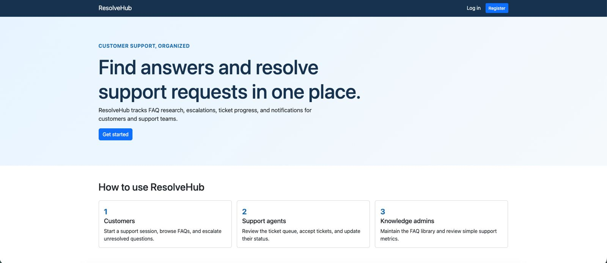

# ResolveHub

ResolveHub is a full-stack customer support platform where users open support sessions, browse a structured FAQ document library, and escalate unresolved issues into trackable support tickets.

Author: Naveen Shankar

Course: Web Development (CS 5610), MS CS at Northeastern University, Boston

Public project page: TODO

Class link: [https://johnguerra.co/classes/webDevelopment_online_summer_2026/](https://johnguerra.co/classes/webDevelopment_online_summer_2026/)

## Project Objective

Customers can start sessions, browse and retrieve FAQ articles by category, tag, or title, view session history, and submit tickets with linked session context. Support agents can view, filter, assign, and update tickets through a defined lifecycle. Knowledge admins can manage FAQ documents and view platform monitoring metrics.

The frontend is built using React with hooks, HTML, and CSS. The backend uses Node.js, Express.js, and MongoDB with the native MongoDB Node.js driver.

## Screenshot



## Build And Run Instructions

Use Node.js 20 or newer and a MongoDB Atlas connection string.

### Setup

Create a `.env` file from `.env.example`:

```env
MONGODB_URI=your-mongodb-connection-string
MONGODB_DB=resolve_hub
BACKEND_PORT=8000
FRONTEND_PORT=3000
SESSION_SECRET=replace-with-a-long-random-string
```

Install dependencies:

```sh
npm install
npm --prefix frontend install
```

Seed the database with the 1,000 Mockaroo FAQs and three demo users:

```sh
npm run seed
```

### Development

Use this while actively working on the project. The Vite dev server provides hot reload for frontend changes, and Nodemon restarts the backend when server files change.

Run the backend:

```sh
npm run dev
```

Run the frontend in a second terminal:

```sh
npm --prefix frontend run dev
```

Open `http://localhost:3000`.

### Production-like (single server)

Use this to run the app the way it behaves in production: one Node server serves the built React app and the API on the same port.

Build the frontend:

```sh
npm run build
```

Start the server:

```sh
npm start
```

Open `http://localhost:8000` (or whatever `BACKEND_PORT` is set to in `.env`).

Rebuild the frontend after UI changes with `npm run build`.

## Demo accounts

- Customer: `customer@resolvehub.demo` / `Customer123!`
- Agent: `agent@resolvehub.demo` / `Agent123!`
- Admin: `admin@resolvehub.demo` / `Admin123!`

## Design Document

The design document is available in `DESIGN.md`. It includes the required project description,
personas, user stories, design mockups/wireframes/screenshots that explain the portfolio's
layout.

## Demo Video

Public narrated demo video: TODO

## Presentation Slides

Google Slides presentation: TODO

## GenAI Disclosure

Generative AI was used as an assistant during this project. AI support included designing
wireframes, verifying that the project met the functional requirements, checking the project
against the rubric, and generating and formatting README and presentation materials.

AI was also used to help generate the main landing page by planning the work in Plan Mode and
then executing that plan in Agent Mode. The project used Cursor IDE with GPT-5.6 models for
complex tasks, Composer 2.5 for subagents, and Composer 2.5 for simple updates.

## License

This project is available under the [MIT License](LICENSE).
